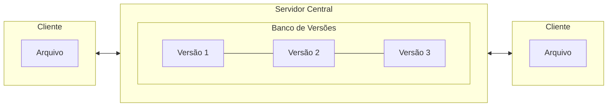
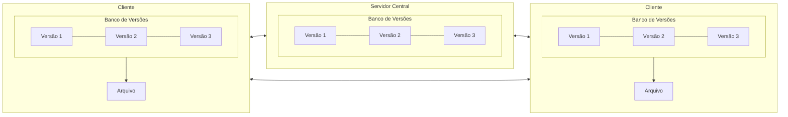

# **Sistemas de Versionamento de Código**

## Versionamento de Código

O versionamento de código permite que os desenvolvedores criem ramificações **(branches)** para trabalhar em funcionalidades ou correções separadamente, sem interferir na versão principal do projeto. Essas ramificações são mescladas **(merged)** ao projeto principal quando prontas.

### Sistemas de Controle de Versão

Principais características dos sistemas de versionamento de código:

- Registra o histórico de atualizações de um arquivo.
- Gerencia quais foram as alterações, a data, autor, etc.
- Organização, controle e segurança.

### Tipos de Sistemas de Controle de Versão

Dentre os Sistemas de Controle de Versão **(VCS)**, temos:

- VCS Centralizados **(CVCSS)**.

    > Ex.: CVS, Subversion.

- VCS Distribuído **(DVCS)**.

    > Ex.: Git, Mercurial.

## VCS Centralizado (CVCS)

Nesse sistema temos um servidor responsável por conter todos os arquivos e conectar ambas as áreas de trabalho para fazer o controle de versão.

### Pontos Positivos:

- Fácil controle central.
- Simplicidade para iniciantes.
- Gerenciamento de acesso mais fácil.

### Pontos Negativos:

- Dependência de um servidor central.
- Difícil para colaboração remota.
- Restrições em criação de branches.

### Diagrama Centralizado

## VCS Centralizado (DVCS)
 
Nesse sistema o banco de versão é duplicado localmente, possibilitando edição mesmo que o servidor esteja fora do ar pois ele clona o repositório completo, o que inclui o histórico de versões.      

### Pontos Positivos:

- Cada clone é como um backup.
- Possibilita um fluxo de trabalho flexível.
- Possibilidade de trabalhar sem conexão a rede.

### Pontos Negativos:

- Complexo no começo.
- Sincronização pode gerar conflitos.
- Risco de divergência entre cópias.

### Diagrama Distribuído

